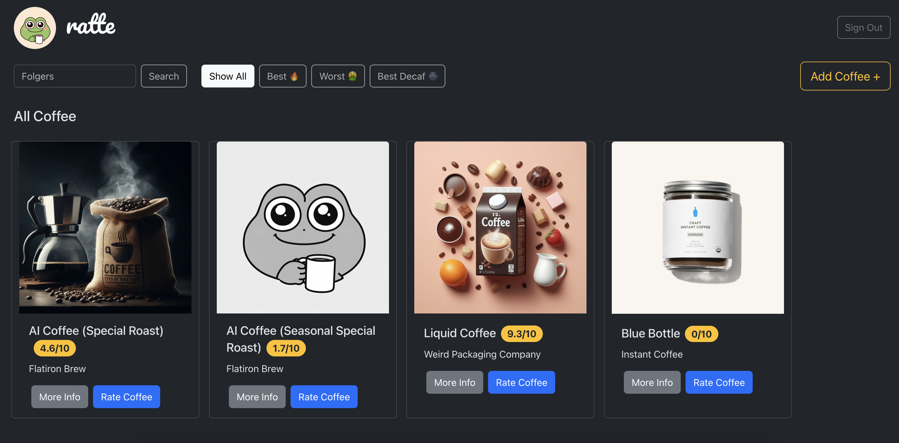

# ratte 🐸☕👌

[***ratte***](https://coffee-anon.onrender.com/) is a website with coffee ratings.  
The project implies sharing coffees and experiences by users.
Find good coffee, rate coffee products you have tried, and add new coffee to the database.

The app is currently in development... 🫄    
Feel free to break it (please don't 🙏).

## How to Use

- ***Home Page***  
  Home page shows all available coffee products with their average overall ratings.
  Click on the coffee card to see the coffee profile.

- ***Coffee Profile***  
  Coffee Profile page contains basic info about the coffee product. Registration is not required to see this page.

- ***Rate Coffee***  
  To rate the coffee product you need an account. Sign up and then sign in with your login and password.
  You can rate coffee's aroma, body, acidity, and the overall flavor. You can edit or delete your review if you will change your mind later.

- ***Add Coffee***  
  Please add new coffee products not in the database using this page. The coffee you added will appear on the Home Page.

## Credits

***ratte*** is made with React. Check out the [React documentation](https://reactjs.org/) to learn React.  
This project uses [React Router](https://reactrouter.com/) for client-side routing.
[React Bootstrap](https://react-bootstrap.netlify.app/) library was used for styling elements.  
The back-end app is built with [Flask](https://palletsprojects.com/p/flask/). The project is hosted on [Render](https://render.com/)

## License

[MIT](https://choosealicense.com/licenses/mit/)
