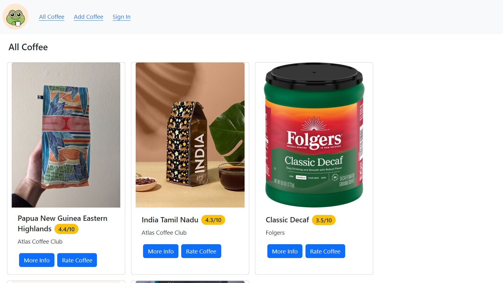

# CoffeeAnon 😋☕🤢

CoffeeAnon is a web app with coffee ratings. The project implies sharing coffees and experiences by users.
Find good coffee, rate coffee products you have tried, and add new coffee to our database.

## How to Install

To install this app locally on your machine follow the steps below.

1. clone the repo by typing this command in your terminal:

```bash
$git clone https://github.com/titamoto/CoffeeAnon.git
```

or if you want to clone using SSH:

```bash
$git clone git@github.com:titamoto/CoffeeAnon.git
```

2. go into the directory inside the directory created by cloning this repo:

```bash
$ cd CoffeeAnon
```

### Set the Server

1. install dependencies and launch virtual environment:

```bash
$ pipenv install && pipenv shell
```

2. go into the `server` directory:

```bash
$ cd server
```

3. Initiate the database and run the migration:

```bash
$ flask db init
$ flask db revision --autogenerate -m 'Create tables'
$ flask db upgrade
```

4. run `seed.py` file to seed the database:

```bash
$ python seed.py
```

5. start the Flask app by running the `app.py` file:

```bash
$ python app.py
```

Your server is going to run on `port:5555` by default. You will see the welcome page on http://localhost:5555 if the server runs successfully.  
Note: If the `python filename.py` command doesn't work for you to run .py files, try `python3 filename.py` instead.

### Set the React App

1. go into the `client` directory:

```bash
$ cd client
```

2. install Node.js dependencies:

```bash
$ npm install
```

3. run the app:

```bash
$ npm start
```

The app is going to run on `port:3000` by default.

## How to Use



- **_Home Page_**
  Home page shows all available coffee products with their average overall ratings.
  Click on the coffee card to see the coffee profile.

- **_Coffee Profile_**
  Coffee Profile page contains basic info about the coffee product. Registration is not required to see this page.

- **_Rate Coffee_**
  To rate the coffee product you need an account. Sign up and then sign in with your login and password.
  You can rate coffee's aroma, body, acidity, and the overall flavor. You can edit or delete your review if you will change your mind later.

- **_Add Coffee_**
  Please add new coffee products not in the database using this page. The coffee you added will appear on the Home Page.

## Credits

CoffeeAnon is made with React. Check out the [React documentation](https://reactjs.org/) to learn React.  
This project uses [React Router](https://reactrouter.com/) for client-side routing.
[React Bootstrap](https://react-bootstrap.netlify.app/) library was used for styling elements.  
The back-end app is built with [Flask](https://palletsprojects.com/p/flask/).

## License

[MIT](https://choosealicense.com/licenses/mit/)
